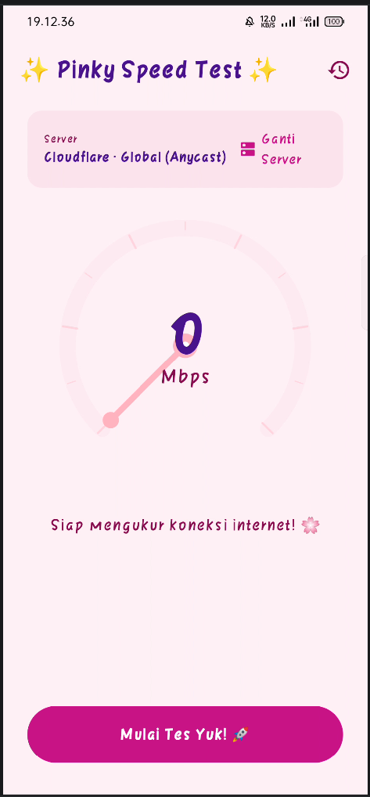
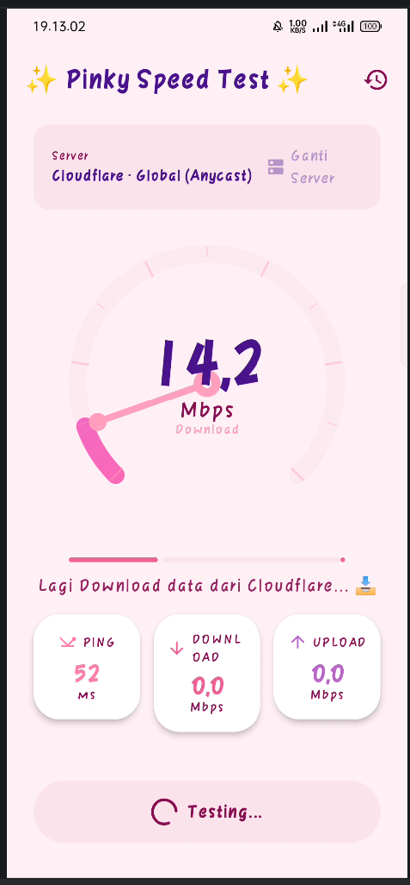
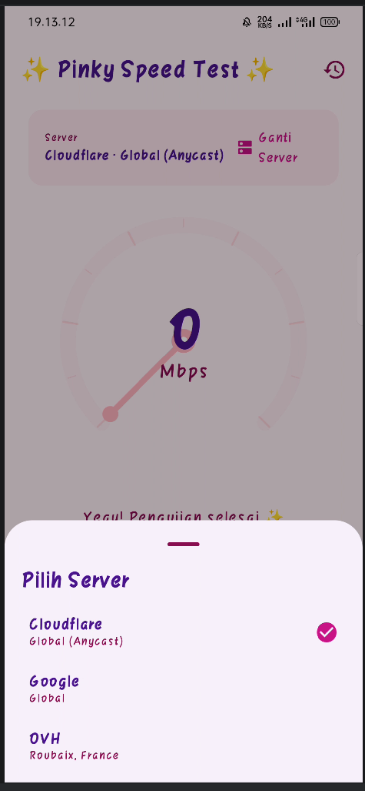
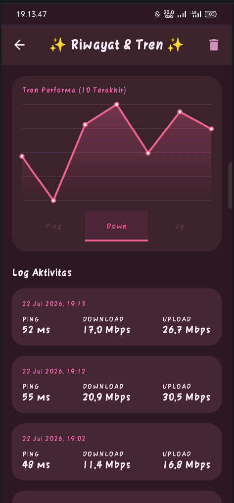
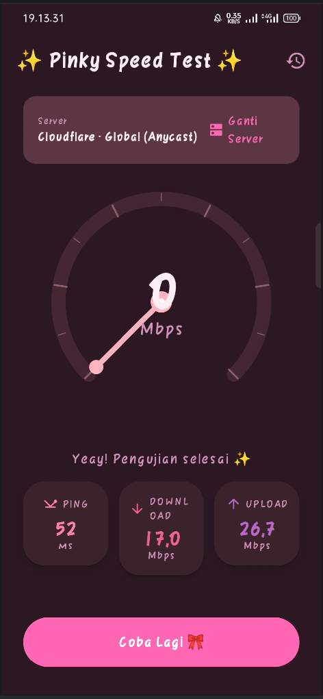

# ✨ Pinky Speed Test ✨

Halo! Selamat datang di **Pinky Speed Test**, aplikasi pengukur kecepatan internet paling *gemoy* dan *aesthetic*! 🌸 🎀

Aplikasi ini dibuat khusus untuk tugas kuliah Pemrograman Mobile dengan sentuhan kasih sayang dan palet warna pink yang super lucu. Gak cuma fungsional buat cek koneksi, tapi juga enak dipandang mata! ✨

---

## 🧸 Identitas Pemilik
- **Nama**  : Muhamad Argi Ferdiansyah 🧚‍♂️
- **NIM**   : 23083000169
- **Kelas** : 6A1
- **Prodi** : Sistem Informasi
- **Universitas** : Merdeka Malang

---

## 🎀 Fitur-Fitur Utama
Aplikasi ini punya banyak fitur keren yang dikemas dalam UI serba pink:

*   **📡 Real-time Speed Gauge**: Lihat kecepatan internetmu lewat *speedometer* bulat yang bubbly!
*   **📥 Download & Upload Test**: Ukur kecepatan unduh dan unggahmu dengan akurat.
*   **⏱️ Ping Measurement**: Cek latensi jaringanmu ke server global.
*   **📜 History Log**: Semua hasil tes tersimpan rapi di database lokal (Room DB).
*   **📈 Trend Chart**: Lihat grafik tren kecepatan internetmu dari 10 percobaan terakhir.
*   **✨ Pinky Theme**: Mendukung Mode Terang & Gelap dengan nuansa *Pink Lavender*.

---

## 📸 Preview Tampilan
Berikut adalah tampilan cantik dari aplikasi **Pinky Speed Test**:

| 🏠 Main Screen (Idle) | 🚀 Testing Process |                   🏆 Pilih Server                    |
|:---:|:---:|:----------------------------------------------------:|
|  |  |  |

| 📜 History & Trend | 🌙 Dark Mode |
|:---:|:---:|
|  |  |

> **Catatan untuk Argi:** Simpan file screenshot kamu di dalam folder `screenshots/` dengan nama file yang sesuai (format `.png`) agar muncul secara otomatis di sini! 🎀

---

## 📂 Struktur Project (The "Inside" of Pinky)
Project ini dibangun dengan arsitektur **MVVM** yang rapi:

```text
app/src/main/java/com/example/speedtest/
├── 🗂️ data/                # Sumber data & Logika inti
│   ├── 🌐 SpeedTestManager  # Jantung pengukur kecepatan (Ping/DL/UL)
│   └── 💾 local/            # Database Room (Entity, DAO, Database)
├── 🗂️ model/               # Model data & State pengujian
├── 🗂️ ui/                  # Tampilan (Jetpack Compose)
│   ├── 🎨 theme/            # Pinky Color Palette & Typography
│   ├── 🧱 components/       # Komponen lucu: SpeedGauge, ResultCard, TrendChart
│   └── 📱 screen/           # Layar Utama & Layar Riwayat
├── 🗂️ viewmodel/           # Pengatur logika UI (State Management)
└── 🚀 MainActivity.kt       # Entry point aplikasi
```

---

## 🛠️ Tech Stack & Tools
Aplikasi ini dibangun menggunakan teknologi terbaru di Android:
- **Language**: Kotlin 100% 💜
- **UI Framework**: Jetpack Compose (Modern & Declarative)
- **Database**: Room Persistence Library
- **Architecture**: MVVM (Model-View-ViewModel)
- **Concurrency**: Kotlin Coroutines & Flow (buat animasi & streaming data yang mulus)

---

## 🎀 Cara Menjalankan
1.  *Clone* atau *Download* repository ini.
2.  Buka di **Android Studio (Koala atau versi terbaru)**.
3.  Tunggu *Gradle Sync* sampai selesai (sambil minum teh hangat 🍵).
4.  Klik tombol **Run** 🏃‍♂️.
5.  Nikmati pengalaman cek internet yang paling *pinky*!

---

## ✨ Note dari Argi
> "Coding itu sulit, tapi kalau hasilnya lucu begini, semuanya jadi worth it! Semoga aplikasi ini bermanfaat dan bisa dapet nilai A! Aamiin... 🤲✨"

Dibuat dengan ✨ dan ☕ oleh **Argi**. 🎀
